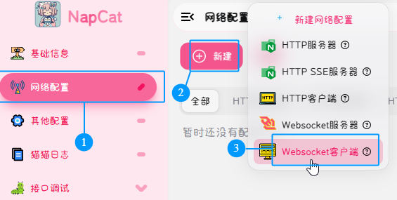
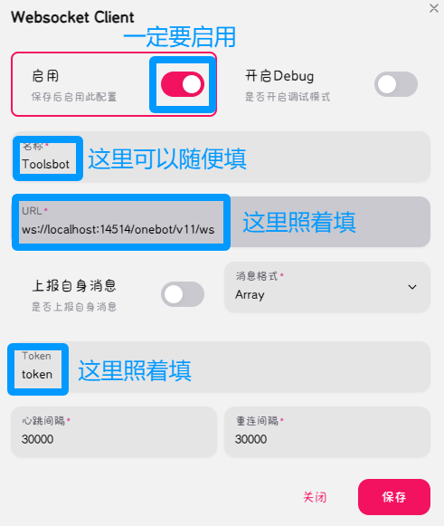

    

<h1 align="center">TLoH Bot</h1>

    
    

    <a href="README.md">中文</a> | <a href="README.en.md">English</a>

<i>优秀的 QQ Bot 实例</i>

> [!Danger]
>
> 该版本的 TLoH Bot（基于 nonebot2）将于 2/28 日正式停止维护。感谢您的支持。
> 新版本的 TLoH Bot 将基于新的框架在后续发布。

> [!Warning]
>
> ToolsBot 已更新，请在 git pull 下来后，执行 python ./scripts/quickmove.py 来迁移用户数据

## 如何使用
先 git clone 下来整个项目。

`
git clone https://github.com/Latingtude/RE-ToolsBot.git
`

以下操作二选一

安装依赖(主环境内)

使用下面这行命令安装所有依赖。

`
python ./scripts/install/installTB.py
`

或者，直接通过 pip 安装：

`
pip install -r ./scripts/install/requirements.txt
`

安装依赖(虚拟环境)

1.安装版本>=3.10的python

2.运行`pip install poetry`

3.运行`poetry install`

(备注:真的有人会想把这个项目部署在主环境里吗)

(只创建一个空项目，选择全局安装)

在所有的事情干完后，修改 `.env.prod` `bot.py` 中的 SUPERUSER 为你自己的 QQ号码。

接下来，打开 `data/configuration_template.toml`，修改其中的 api_key 项目为你的服务提供商 API Key。随后重命名为 `configuration.toml`。
若不需要，请直接重命名为 `configuration.toml`。

随后，运行 `nb run --reload` 来启动 bot.

## 这个 bot 怎么链接到 QQ？

先安装NapCat并登录Bot的QQ账号 https://github.com/NapNeko/NapCatQQ.

随后在“网络配置” --> 新建 --> Websocket客户端 中填写名称，URL和token

## 使用教程？
在 Bot 上线之后，用 ^help，或者参考这个图片：

## 感谢
> [!Note]
>
> 感谢以下项目，我参考了以下项目的部分代码。

<a href="https://github.com/yzyyz1387/nonebot_plugin_admin/">NoneBot Plugin Admin</a>

## 警告

> [!Warning]
>
> 该项目目前并不稳定。请不要直接克隆该项目，我没办法做到自检查代码的每一处角落。
>
> 如果你发现了任何问题，请在 `Github Issues` 中发表一个 Issue。
